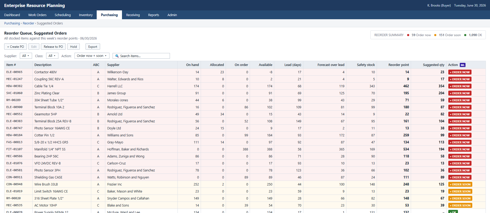
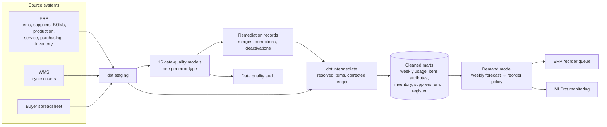

# ERP Data Quality Audit & Demand Forecasting

A comprehensive data quality audit of an industrial equipment manufacturer's ERP system. The cleaned data feeds a machine learning model that forecasts demand for every stocked item and sets the shop's reorder points and order quantities.

The data quality audit covered all of the records across the ERP's eight tables and found 16 types of recurring data quality errors. It details the remediation process, which resolved the majority of these errors, as well as the process changes that will keep the ERP system clean going forward.

The machine learning model makes weekly reordering predictions for each of the shop's 1,300 stocked items. It forecasts each item's expected usage over its supplier lead time and turns this into a reorder point and order quantity. It was calibrated to ensure minimal stockouts, jobs held for material and expedited freight, while keeping inventory as low as possible. **As detailed in the deliverables, this model achieved significant improvements across production and purchasing KPIs while at the same time releasing working capital through a lower inventory balance.**

The model is supported by technical documentation and MLOps monitoring in production.

The model's reorder suggestions are embedded in the company's existing ERP purchasing screen, as shown below:

[](https://brimsystems.github.io/mfg-demand-forecasting/docs/index.html)

> **[Open the live reorder queue &rarr;](https://brimsystems.github.io/mfg-demand-forecasting/docs/index.html)** &nbsp;·&nbsp; **[All five deliverables &rarr;](https://brimsystems.github.io/mfg-demand-forecasting/)**

---

## Business Context

An industrial equipment manufacturer, making conveyors and material-handling modules, industrial mixers and agitators, and custom enclosures and frames, stocks about 1,300 purchased items from 40 suppliers. Its products carry multi-level bills of materials, and material is consumed by production jobs, service and spare-parts orders, and manual issues.

Two buyers and a purchasing manager reordered by hand. They could not trust the ERP: its lead times and reorder points were years out of date, the same part sat under several item numbers, dead items were still flagged active, and receipts were posted late and in batches. So they kept their own spreadsheet, padded safety stock well beyond what usage required, and relied on rush orders to cover the shortfalls. The shop carried roughly 160 days of usage in inventory, yet still logged frequent stockouts, jobs held for missing material and rush freight spend.

The work had two parts. First, a full data quality audit of the ERP found 16 types of error across its master and transaction tables, remediated them, and put process changes in place so they would not recur. Second, a demand model was trained on the cleaned history. Every week it forecasts how much of each item the shop will use before a new order could arrive, and turns that forecast into a reorder point and an order quantity loaded straight into the ERP's purchasing screen. The model has set every reorder decision since January 2026.

---

## Deliverables

| # | Deliverable | What it is | Links |
|---|---|---|---|
| 1 | ERP reorder queue | The demand model embedded in the ERP's purchasing screen: each item's on-hand, allocated, on-order and available stock, forecast usage over its lead time, safety stock, reorder point and suggested order quantity, with its criticality, ranked by urgency. | [View](https://brimsystems.github.io/mfg-demand-forecasting/docs/index.html) |
| 2 | Data quality audit | Every type of error found across the ERP's master and transaction tables, its scale, the remediation performed and its evidence, the before-and-after results, and the process changes that stop each error recurring. | [View](https://brimsystems.github.io/mfg-demand-forecasting/docs/reports/data_quality_audit.html) |
| 3 | ML model overview & performance report | A high-level summary of the model: what it does, the usage it learns from, how it sets each reorder, and its results against 2025 and the status quo. | [View](https://brimsystems.github.io/mfg-demand-forecasting/docs/reports/model_overview.html) |
| 4 | ML technical report | The model card, training data and time-based split, model selection and performance, SHAP feature importance, the rules that turn a forecast into a reorder decision, known limitations, and deployment. | [View](https://brimsystems.github.io/mfg-demand-forecasting/docs/reports/technical_report.html) |
| 5 | MLOps monitoring report | Monthly monitoring of the live model against Investigate and Retrain thresholds: forecast error and bias overall and by demand pattern, drift, data quality and business KPIs, with a rules-based retraining decision. | [View](https://brimsystems.github.io/mfg-demand-forecasting/docs/reports/monitoring_report.html) |

---

## Code

### Data pipeline: [`data_pipeline/models/`](data_pipeline/models/)

| Layer | What it is, does and contains |
|---|---|
| Staging | One model per source table (ERP, WMS and the buyers' spreadsheet), plus the cleanup's remediation records and the generator's ground truth. Each types and cleans the raw data into a consistent shape and format. |
| Data quality | One model per error in the audit, sixteen in all, each flagging the records affected: dead and duplicate item records, stale lead times and reorder points, UOM mismatches, missing fields, BOM omissions, fragmented suppliers, and the ledger and purchasing errors. |
| Intermediate | Applies the remediation without overwriting the source: resolves duplicate records to one canonical item, applies the confirmed ledger corrections, and assembles recorded usage and its corrections by item, month and week. |
| Marts | The analysis-ready tables the audit and model read: raw, master-cleaned and fully cleaned usage, true demand, weekly usage, item attributes (demand pattern, ABC class, corrected lead time), inventory position, supplier performance, and the audit's error register. |

### Data cleaning: [`data_pipeline/models/data_quality/`](data_pipeline/models/data_quality/) and [`data_source/generate/remediation.py`](data_source/generate/remediation.py)

| File | What it does |
|---|---|
| `data_quality/dq_01` to `dq_16` | Flags the records affected by each of the sixteen errors in the audit. |
| `marts/mart_dq_error_summary.sql` | Rolls the flagged records into the audit's error register: rows affected and rows in scope for each error and ERP table. |
| `remediation.py` | Produces the records the cleanup leaves behind: dead-item dispositions, duplicate and supplier crosswalks, UOM conversions, recomputed lead times and reorder points, ledger corrections, document closures and the free-text attributions. |
| `ml/src/reliability.py` | Classes every item's on-hand balance as reliable, uncertain or unreliable, before and after remediation. |
| `ml/src/financials.py` | Measures what the errors cost and what the cleanup achieved, from the records: rush spend and shortages traced to each error, inventory write-offs and phantom on-order, and the before-and-after measures in the audit's results. |

### Machine learning model: [`ml/src/`](ml/src/)

| File | What it does |
|---|---|
| `export_marts.py` | Exports the dbt marts the model reads to parquet. |
| `baselines.py` | Simple forecasting methods (naive, seasonal naive, moving averages, exponential smoothing, Croston) and the rolling-origin backtest harness. |
| `features.py`, `training.py` | Feature building, the model candidates and the evaluation helpers the weekly model shares. |
| `training_3way.py` | Runs the same model on raw, master-cleaned and fully cleaned history to measure what each tier of cleaning is worth. |
| `forward_policy.py` | The production model: builds the weekly features, tunes random forest, XGBoost and ridge regression with Optuna, selects the winner, retrains it monthly, and turns each week's forecast into bias-corrected reorder points, safety buffers and order quantities for the ERP. |
| `explain_weekly.py` | SHAP feature importance, the learning curve, feature correlations and the train, validation and test summary for the technical report. |
| `monitor_weekly.py` | Monthly monitoring against Investigate and Retrain thresholds: forecast error and bias overall and by demand pattern, target, prediction and feature drift, data quality and business KPIs. |

---

## How it works



Raw extracts from the ERP, the warehouse system and the buyers' spreadsheet are typed in dbt staging models on DuckDB. Sixteen data-quality models, one per error in the audit, flag the affected records, from dead and duplicate item records and stale lead times to free-text purchases and purchase orders never closed; a summary mart turns them into the audit's error register. The remediation is recorded as auditable merges, corrections and deactivations, which the intermediate models apply without overwriting the source: duplicate records resolve to one canonical item, confirmed ledger corrections are applied, and lead times are recomputed from actual receipts. The marts then hold cleaned weekly usage, item attributes (demand pattern, ABC class, corrected lead time), the inventory position and supplier performance.

Because the data is generated, dbt also reads the generator's record of what it planted, flattened into tables by [`data_source/generate/export_truth.py`](data_source/generate/export_truth.py): the true duplicate clusters, the usage that was never recorded, the planned value classes and true demand. These stand in for findings the business confirmed, and they let the marts carry raw, master-cleaned and fully cleaned versions of the usage history, plus a true-demand series to score each version against. The model reads its marts from the warehouse, exported to parquet by [`ml/src/export_marts.py`](ml/src/export_marts.py), and the data quality audit reads its error register from the `mart_dq_error_summary` mart.

The demand model is a random forest, selected over XGBoost and ridge regression on a 2024 validation window and tested on the full 2025 year. Every Monday it forecasts each item's usage over its supplier lead time. That forecast is bias-corrected by demand pattern and combined with a safety buffer, sized from the model's own errors to each item type's fill-rate target, and a cost-based order quantity. The result is loaded into the ERP's reorder queue. The model is retrained monthly and monitored each month against its 2025 performance.

---

## Data

The datasets were generated to represent typical records from a manufacturing ERP, its warehouse system and a buyer's spreadsheet, with error types and rates constructed to reflect patterns commonly documented in these systems, so the full workflow can be demonstrated on data that is safe to share publicly. The [generators are in `data_source/generate/`](data_source/generate/).

---

## Running it locally

```bash
# 1. Environment
python3 -m venv .venv
source .venv/bin/activate          # Windows: .venv\Scripts\activate
pip install -e .

# 2. Generate the source data and remediate it
python3 -m data_source.generate.run_generator
python3 -m data_source.generate.validate
python3 -m data_source.generate.remediation
python3 -m data_source.generate.export_truth

# 3. Warehouse: staging, data-quality models, intermediate models and marts
cd data_pipeline && dbt build --profiles-dir . && cd ..
python3 -m ml.src.export_marts

# 4. Baselines, model selection, the weekly forecast and reorder policy, and explainability
python3 -m ml.src.baselines
python3 -m ml.src.training
python3 -m ml.src.training_3way
python3 -m ml.src.forward_policy
python3 -m ml.src.explain_weekly

# 5. Replay January to June 2026 on the model's reorder schedule
python3 -m data_source.generate.run_generator
python3 -m data_source.generate.validate
python3 -m data_source.generate.remediation
python3 -m data_source.generate.export_truth
cd data_pipeline && dbt build --profiles-dir . && cd ..
python3 -m ml.src.export_marts
python3 -m ml.src.reliability
python3 -m ml.src.financials

# 6. Monitoring
python3 -m ml.src.monitor_weekly

# 7. Client-facing deliverables
python3 ml/reports/generate_data_quality_audit.py
python3 -m ml.reports.generate_reorder_queue
python3 -m ml.reports.generate_model_overview
python3 -m ml.reports.generate_technical_report
python3 -m ml.reports.generate_monitoring_report
```

The report generators write standalone HTML to [`docs/`](docs/), which GitHub Pages serves.

---

## Stack

| Layer | Tools |
|---|---|
| Integration & transformation | dbt, DuckDB |
| Data quality & remediation | dbt data-quality models, Python, pandas |
| Data generation | Python, pandas, NumPy |
| Modeling | scikit-learn (random forest, ridge regression), XGBoost, Optuna, SHAP |
| Monitoring | SciPy (Jensen-Shannon distance), pandas |
| Reporting | matplotlib, HTML/CSS |
| Delivery | Static HTML, GitHub Pages |

---

Brian Davis, fractional data engineering and analytics partner for SMB manufacturers &middot; brian@brimsystems.com
