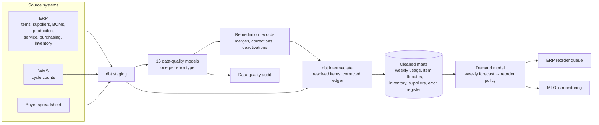

# Manufacturing Data Platform: Inventory Forecasting & ERP Data Quality

**An end-to-end data platform for a mid-sized manufacturer, spanning data engineering, data quality and machine learning, applied to inventory forecasting and ERP data quality.**

It starts with a **data pipeline** in dbt on DuckDB that integrates the shop's item, supplier, bill-of-materials, production, service, purchasing, inventory and cycle-count records, flags the errors in them through one data-quality model per error type, applies the remediation, and models the cleaned history into marts.

A **data quality and ML layer** is then built on top of that cleaned dataset, including:

1. **Data quality audit** that finds every type of error in the ERP, remediates it, and sets the process changes that stop it recurring
2. **Machine learning model** that forecasts each item's usage over its supplier lead time and turns it into a reorder point and order quantity, supported by technical documentation and MLOps monitoring in production

The model's reorder suggestions are embedded into the company's existing ERP purchasing screen, as shown below:

[](https://brimsystems.github.io/mfg-inventory-forecast/docs/index.html)

> **[Open the live reorder queue &rarr;](https://brimsystems.github.io/mfg-inventory-forecast/docs/index.html)** &nbsp;·&nbsp; **[All five deliverables &rarr;](https://brimsystems.github.io/mfg-inventory-forecast/)**

---

## Business Context

An industrial equipment builder, making conveyors and material-handling modules, industrial mixers and agitators, and custom enclosures and frames, stocks about 1,300 purchased items from 40 suppliers. Its products carry multi-level bills of materials, and material is consumed by production jobs, service and spare-parts orders, and manual issues.

Two buyers and a purchasing manager reordered by hand. They could not trust the ERP: its lead times and reorder points were years out of date, the same part sat under several item numbers, dead items were still flagged active, and receipts were posted late and in batches. So they kept their own spreadsheet, padded safety stock well beyond what usage required, and relied on rush orders to cover the shortfalls. The shop carried roughly 160 days of usage in inventory, yet still logged frequent stockouts, jobs held for missing material and rush freight spend.

The work had two parts. First, a full data quality audit of the ERP found 16 types of error across its master and transaction tables, remediated them, and put process changes in place so they would not recur. Second, a demand model was trained on the cleaned history. Every week it forecasts how much of each item the shop will use before a new order could arrive, and turns that forecast into a reorder point and an order quantity loaded straight into the ERP's purchasing screen. The model has set every reorder decision since January 2026.

---

## Deliverables

| # | Deliverable | What it is | Links |
|---|---|---|---|
| 1 | ERP reorder queue | The demand model embedded in the ERP's purchasing screen: each item's on-hand, allocated, on-order and available stock, forecast usage over its lead time, safety stock, reorder point and suggested order quantity, with its criticality, ranked by urgency. | [View](https://brimsystems.github.io/mfg-inventory-forecast/docs/index.html) |
| 2 | Data quality audit | Every type of error found across the ERP's master and transaction tables, its scale, the remediation performed and its evidence, the before-and-after results, and the process changes that stop each error recurring. | [View](https://brimsystems.github.io/mfg-inventory-forecast/docs/reports/data_quality_audit.html) |
| 3 | ML model overview & performance report | A high-level summary of the model: what it does, the usage it learns from, how it sets each reorder, and its results against 2025 and the status quo. | [View](https://brimsystems.github.io/mfg-inventory-forecast/docs/reports/model_overview.html) |
| 4 | ML technical report | The model card, training data and time-based split, model selection and performance, SHAP feature importance, the rules that turn a forecast into a reorder decision, known limitations, and deployment. | [View](https://brimsystems.github.io/mfg-inventory-forecast/docs/reports/technical_report.html) |
| 5 | MLOps monitoring report | Monthly monitoring of the live model against Investigate and Retrain thresholds: forecast error and bias overall and by demand pattern, drift, data quality and business KPIs, with a rules-based retraining decision. | [View](https://brimsystems.github.io/mfg-inventory-forecast/docs/reports/monitoring_report.html) |

---

## How it works



Raw extracts from the ERP, the warehouse system and the buyers' spreadsheet are typed in dbt staging models on DuckDB. Sixteen data-quality models, one per error in the audit, flag the affected records, from dead and duplicate item records and stale lead times to free-text purchases and purchase orders never closed; a summary mart turns them into the audit's error register. The remediation is recorded as auditable merges, corrections and deactivations, which the intermediate models apply without overwriting the source: duplicate records resolve to one canonical item, confirmed ledger corrections are applied, and lead times are recomputed from actual receipts. The marts then hold cleaned weekly usage, item attributes (demand pattern, ABC class, corrected lead time), the inventory position and supplier performance.

Because the data is generated, the model's training marts are built by [`ml/src/prep_marts.py`](ml/src/prep_marts.py), which also produces raw, partly cleaned and fully cleaned versions of the history and scores each against the generator's true demand. The dbt marts cover the same 1,300 items and match their total usage to within 0.2%.

The demand model is a random forest, selected over XGBoost and ridge regression on a 2024 validation window and tested on the full 2025 year. Every Monday it forecasts each item's usage over its supplier lead time. That forecast is bias-corrected by demand pattern and combined with a safety buffer, sized from the model's own errors to each item type's fill-rate target, and a cost-based order quantity. The result is loaded into the ERP's reorder queue. The model is retrained monthly and monitored each month against its 2025 performance.

---

## Results

All figures below are read directly from the pipeline in this repository.

- **Data quality:** over 228K records across eight ERP tables were audited, and 16 types of error were found. The largest were dead records (40% of item master records were inactive but still flagged active), stale lead times (56% of live items) and stale reorder points (77% of live items). After remediation, 100% of live items carry a lead time matching actual deliveries and a reorder point reflecting real usage, up from 4% and 23%.
- **Operations:** in its first six months (January to June 2026), the model cut stockout events by 34%, jobs held for material by 32% and rush spend by 38% against the 2025 monthly averages.
- **Working capital:** inventory fell 10%, about $340K, from December 31, 2025 to June 30, 2026, alongside those improvements. The entire reduction is a release of working capital.
- **Forecast accuracy:** live forecast error (WAPE) of 46%, against 45.7% on the held-out 2025 year and 50% for the best simple forecasting method.
- **Monitoring:** the monitoring report recommends a full retrain on data through June 2026, because forecast error and bias on intermittent items rose above their Retrain thresholds in March and April. Separately, the safety buffers should be recalibrated, since fill rates ran more than 1 point below target from January to May.

---

## Data

The datasets were generated to represent typical records from a manufacturing ERP, its warehouse system and a buyer's spreadsheet, with error types and rates constructed to reflect patterns commonly documented in these systems, so the full workflow can be demonstrated on data that is safe to share publicly. The [generators are in `data_source/generate/`](data_source/generate/).

---

## Running it locally

```bash
# 1. Environment
python3 -m venv .venv
source .venv/bin/activate          # Windows: .venv\Scripts\activate
pip install -e .

# 2. Generate the source data, remediate it and build the marts
python3 -m data_source.generate.run_generator
python3 -m data_source.generate.validate
python3 -m data_source.generate.remediation
python3 -m ml.src.prep_marts

# 3. Warehouse: staging, data-quality models, intermediate models and marts
cd data_pipeline && dbt build --profiles-dir . && cd ..

# 4. Baselines, model selection and the weekly forecast and reorder policy
python3 -m ml.src.baselines
python3 -m ml.src.training
python3 -m ml.src.training_3way
python3 -m ml.src.forward_policy

# 5. Replay January to June 2026 on the model's reorder schedule
python3 -m data_source.generate.run_generator
python3 -m data_source.generate.validate
python3 -m data_source.generate.remediation
python3 -m ml.src.prep_marts
python3 -m ml.src.reliability
python3 -m ml.src.financials
cd data_pipeline && dbt build --profiles-dir . && cd ..

# 6. Explainability and monitoring
python3 -m ml.src.explain_weekly
python3 -m ml.src.monitor_weekly

# 7. Client-facing deliverables
python3 ml/reports/generate_data_quality_audit.py
python3 -m ml.reports.generate_reorder_queue
python3 -m ml.reports.generate_model_overview
python3 -m ml.reports.generate_technical_report
python3 -m ml.reports.generate_monitoring_report
```

The report generators write standalone HTML to [`docs/`](docs/), which GitHub Pages serves.

---

## Stack

| Layer | Tools |
|---|---|
| Integration & transformation | dbt, DuckDB |
| Data quality & remediation | dbt data-quality models, Python, pandas |
| Data generation | Python, pandas, NumPy |
| Modeling | scikit-learn (random forest, ridge regression), XGBoost, Optuna, SHAP |
| Monitoring | SciPy (Jensen-Shannon distance), pandas |
| Reporting | matplotlib, HTML/CSS |
| Delivery | Static HTML, GitHub Pages |

---

Brian Davis, fractional data engineering and analytics partner for SMB manufacturers &middot; brian@brimsystems.com
